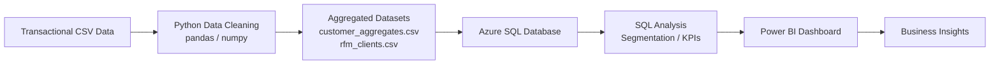
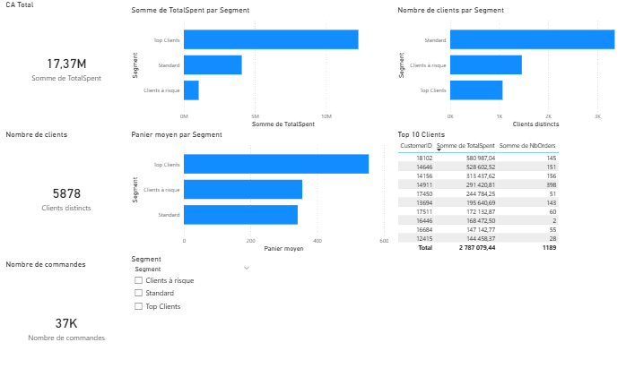

## 📊 Customer Analysis with RFM Segmentation
🧠 Contexte du projet

Ce projet a pour objectif d’analyser le comportement des clients à partir de données transactionnelles afin de mieux comprendre la répartition du chiffre d’affaires, identifier les clients à forte valeur et mettre en évidence les clients à risque.

L’analyse repose sur une segmentation RFM (Recency, Frequency, Monetary) et se termine par la création d’un dashboard Power BI destiné à une lecture métier.

## 🎯 Objectifs

Analyser les données clients et transactions

Nettoyer et préparer les données pour l’analyse

Mettre en place une segmentation RFM

Identifier les segments de clients clés

Visualiser les résultats via un dashboard Power BI

## ⚙️ Data Pipeline

Le projet suit un pipeline de données complet proche de ce qui est mis en place dans un environnement BI en entreprise :

CSV transactionnels
⬇️
Python (pandas) - nettoyage et préparation des données
⬇️
Export de données agrégées
⬇️
Azure SQL Database - stockage des données
⬇️
SQL - analyses métier et validation des indicateurs
⬇️
Power BI - création du dashboard de visualisation

## 📐 Architecture du pipeline

## 🗂️ Données utilisées

Les données proviennent d’un jeu de données transactionnelles clients et ont été agrégées pour obtenir :

des indicateurs par client (nombre de commandes, montant total dépensé, quantités)

des métriques RFM (Recency, Frequency, Monetary)

Fichiers principaux :

customer_aggregates.csv

rfm_clients.csv

## 🔎 Démarche analytique

Le projet est structuré en plusieurs étapes, chacune documentée dans un notebook Jupyter :

Exploration des données
Analyse de la structure des données, types de variables, valeurs manquantes.

Nettoyage des données
Suppression des lignes non exploitables, correction des types de données, création de variables utiles.

Analyse descriptive
Calcul des indicateurs clés (chiffre d’affaires, nombre de clients, panier moyen, etc.).

## Segmentation RFM

Recency : nombre de jours depuis le dernier achat

Frequency : nombre de commandes

Monetary : montant total dépensé
Attribution de segments clients (Top Clients, Standard, Clients à risque).

Synthèse et interprétation métier
Mise en évidence des segments les plus contributeurs au chiffre d’affaires.

## 📈 Résultats clés

L'analyse met en évidence une forte concentration du chiffre d'affaires sur un nombre limité de clients : une minorité de clients génère la majorité du chiffre d’affaires (principe de Pareto 80/20).

Les Top Clients représentent le segment le plus stratégique.

Les Clients à risque contribuent faiblement au chiffre d’affaires et nécessitent des actions de réactivation.

La segmentation RFM constitue une base pertinente pour des actions marketing ciblées.

Cette analyse fournit une base décisionnelle exploitable pour orienter des actions marketing, de fidélisation et d’optimisation de la valeur client.

## 📊 Dashboard Power BI

Un dashboard Power BI a été réalisé pour faciliter la lecture métier :

KPI principaux :

Chiffre d’affaires total

Nombre de clients

Nombre total de commandes

Panier moyen

Visualisations :

Chiffre d’affaires par segment client

Panier moyen par segment client

Répartition des segments RFM

Tableau des TOP 10 clients générant le plus de chiffre d'affaires

Le fichier Power BI est disponible dans le dossier :

powerbi/

Aperçu du dashboard :

## 🧮 Analyse SQL

Les données ont été importées dans une base Azure SQL Database afin de reproduire un environnement proche d'une architecture BI réelle.

Les analyses SQL ont permis de :
- calculer le chiffre d’affaires total
- analyser le chiffre d’affaires par segment client
- déterminer le nombre de clients par segment
- calculer le panier moyen
- identifier les clients générant le plus de chiffre d’affaires

Les requêtes SQL sont disponibles dans le dossier sql/

Cette étape permet de valider les indicateurs métiers directement au niveau de la base de données.

## 🛠️ Stack technique

Python (pandas, numpy)

SQL

Azure SQL Database

Power BI

Jupyter Notebook / Visual Studio Code 

Git / GitHub

## 🚀 Pistes d’amélioration

Analyse temporelle plus détaillée (saisonnalité, évolution mensuelle)

Ajout d’indicateurs de rétention client

Intégration d’autres sources de données (marketing, géographie)

Automatisation du pipeline avec Azure Data Factory ou Airflow

## 👤 Auteur

Projet réalisé par Tristan Darcourt-Germain
Dans le cadre d’un parcours de montée en compétences en Data Analysis / Business Intelligence.
